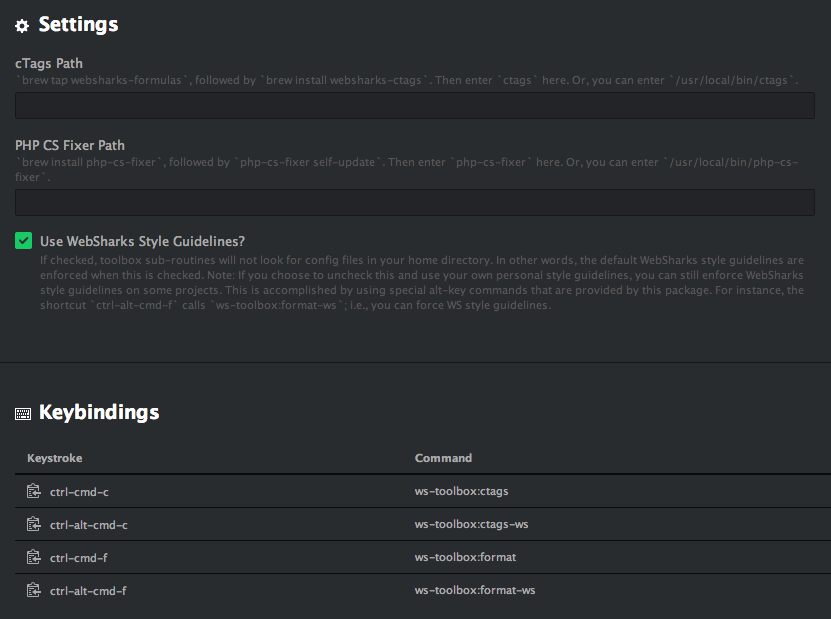

# Atom Toolbox

## Installation Instructions

- Install via Atom package manager. Or from the command line.

  ```
  $ apm install ws-toolbox
  ```

- Configure; i.e., explore Settings page in Atom; (screenshot below).




## Key Bindings

To learn keyboard shortcuts, please see:
**Atom → Main Menu Bar → Packages → WebSharks Toolbox**
_This will show you the available commands their keyboard shortcuts._
